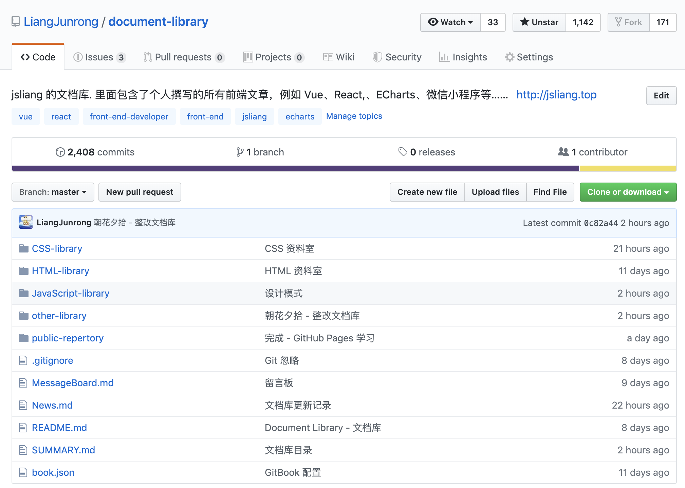
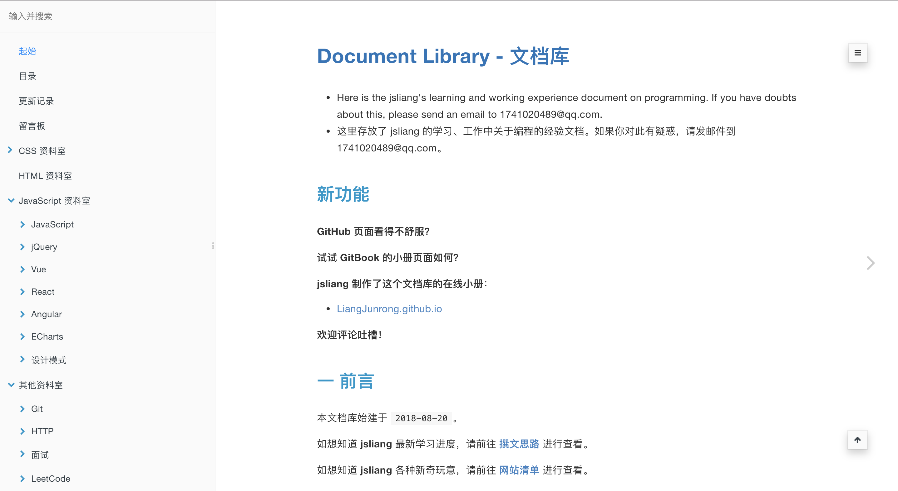

朝花夕拾 - 变更
===

> Create by **jsliang** on **2019-05-31 17:17:45**  
> Recently revised in **2019-05-31 19:10:09**

**不折腾的前端，和咸鱼有什么区别！**

## 一 前言

**jsliang** 的文档库（[document-library](https://github.com/LiangJunrong/document-library)）创建于 **2018-08-20**，期间经过好几次的大更改，目前已有超 **2400** 次的 commit，**1140** 多的 star 以及近 **120** 多篇原创文章。

在两周前（2019-05-20），**jsiang** 机缘巧合之下看到用 GitBook 重构下文档库是个不错的选择，于是投入了重改文档库的大工程中，并成功在今天（2019-05-31）改造文档库完毕。

* [jsliang 的文档库](https://github.com/LiangJunrong/document-library)

* [jsliang 的 GitBook 小册](https://liangjunrong.github.io/)

截至今天，**jsliang** 除了：

* **正则表达式**
* **原生 Node 教程**
* **ECharts 打造个人简历**
* ……等

这些单篇幅文章在 **掘金** 受到小伙伴们的欢迎外，**jsliang** 根据自己编写文档库的思路，将文章划分出一些模块：

* **Vue 系列学习**
* **React 系列学习**
* **MarkDown 打造静态网站系列**
* **LeetCode 系列攻略**

后期会持续完善文档库，希望能帮助小伙伴们在前端的路上快活前行~

## 一 单篇系列推荐文章

* 

## 一 React 系列学习

## 二 Vue 系列学习

## 三 Markdown 打造静态网站

目前 **jsliang** 的联系方式、文档库地址、GitBook 小册地址以及公众号如下：

* 微信：

* 微信群：

* QQ：`1741020489`
* QQ 群：`798961601`
* 公众号：暂无
* 文档库地址：[jsliang 的文档库](https://github.com/LiangJunrong/document-library)
* GitBook 小册地址：[LiangJunrong.github.io](https://liangjunrong.github.io/)

---

> **jsliang** 广告推送：  
> 也许小伙伴想了解下云服务器  
> 或者小伙伴想买一台云服务器  
> 或者小伙伴需要续费云服务器  
> 欢迎点击 **[云服务器推广](https://github.com/LiangJunrong/document-library/blob/master/other-library/Monologue/%E7%A8%B3%E9%A3%9F%E8%89%B0%E9%9A%BE.md)** 查看！

>  jsliang 的文档库 由 <a xmlns:cc="http://creativecommons.org/ns#" href="https://github.com/LiangJunrong/document-library" property="cc:attributionName" rel="cc:attributionURL">梁峻荣</a> 采用 <a rel="license" href="http://creativecommons.org/licenses/by-nc-sa/4.0/">知识共享 署名-非商业性使用-相同方式共享 4.0 国际 许可协议</a>进行许可。 基于<a xmlns:dct="http://purl.org/dc/terms/" href="https://github.com/LiangJunrong/document-library" rel="dct:source">https://github.com/LiangJunrong/document-library</a>上的作品创作。 本许可协议授权之外的使用权限可以从 <a xmlns:cc="http://creativecommons.org/ns#" href="https://creativecommons.org/licenses/by-nc-sa/2.5/cn/" rel="cc:morePermissions">https://creativecommons.org/licenses/by-nc-sa/2.5/cn/</a> 处获得。